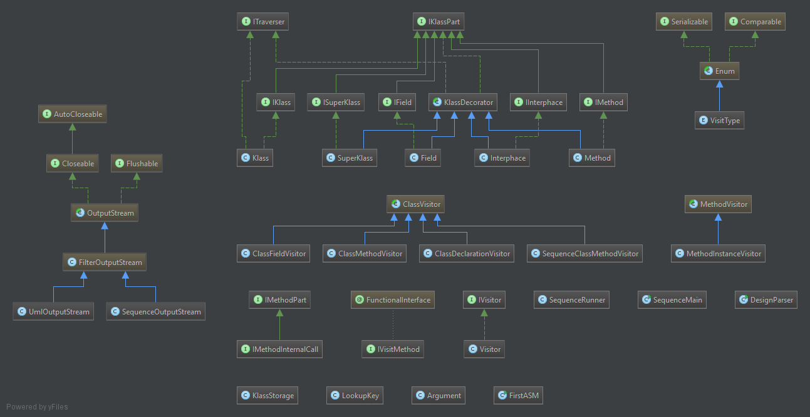

# UML-Gen

## Milestone 3 Design
Our application has several design types.
Our Asm parser uses a decorator pattern to decorate visitor pattern visitors. 

These visitors utilize our internal data storage which is a slight play on decorator allowing for multiple unique objects and individual object ownership.
This data structure is also traversable.

Finally we one of two lambda style visitors for visit the data structure depending on if we are looking to generate UML diagrams or sequence diagrams.

## Pre Milestone 3 Design
Our design is based off of a culmination of two design patterns. We kept the intial visitor pattern from asm and then, using the decorator pattern, we created a storage system to represent the class structure . 

In this pattern interfaces, a superclass, fields, and methods are all added as decorators to a base class object as parses through the java class files. 

We then created a KlassStorage instance to allow each set of interfaces a shared memory system on which to decorate the class. This keeps the instance updating with each call.

Our design will be simple to adjust and is flexable at runtime. The only issues is the shared memory is not completely thread safe, nor do we use thread safe datastructures. 

## Who Did What
###M1:
Everyone alternated pair programming on Doolan's Desktop for the design and the first part of the implementation.
######Austin
    Started working on the automated testing once there was enough working code to test.
######Doolan and Davis
<<<<<<< Updated upstream
    alternated on Doolan's PC finishing the project implementation and fixing bugs.

=======
 alternated on Doolan's PC finishing the project implementation and fixing bugs.
 
 
 
-----
>>>>>>> Stashed changes
###M2:
Doolan's Desktop was used for the bulk of the coding.
#####Doolan and Davis
    Doolan took care of the initial method implantation, the RegEx and String parsing.
    Davis took care of the base field alterations implemtations.
    Davis and Doolan read through and attempted to trouble shoot the following ASM 5.0 class documents:
     +MethodVisitor
        ..+visitLocalVariableAnnotation
        ..+visitVarInsn
     +ClassVisitor
     +ClassReader
     +CodeReader
#####Niccum
    Created tests that established the correct behavior of arrow detection code
    Visually tested the  Abstract Factory PizzaStore
    Updated UML diagrams of our code

###M3:
For milestone 3, our team did a semi-complete redesign of milestone 1 and 2 in order to better utilize design principals and make the application more versatile. 
#####Doolan
    Doolan started off this milestone by refactoring the base design. 
    He removed and added dependanes, removed all of the print methods in instances of klassparts and added and additional Lambda Style visitor pattern. 
    He also visually tested these changes to make sure it worked.
#####Davis 
    Davis then took this modified design and added the abiltity to sub traverse methods by adding an ASM method visitor instance. 
    He got the project up to Milestone 2.
#####Doolan and Davis
    Doolan and Davis then took the code further to address the milestone 3 requiermnets. 
    Doolan worked on writing a constrocture function to initiate the limited traversal using the ASM visitors and design structure.
    Davis worked on learning SdEdit and the print pattern needed. Doolan and Davis then debuged and interagrated the code
#####Niccum
    Through the milestone Niccum pulled down the changes to the code and implemented automated unit tests. 
    He also manually generated diagrams to use as a baseline for the project code. 
    Finaly he assisted in Debugging attempts and visually tested the outputed diagrams. 

## Instructions
#####UML
The main method in the designParser class is run with the paths to the class names as argument strings. The DOT file result can then be passed into GraphViz to generate the UML image.
#####Sequence Diagram
Run the main method in teh Sequence Main class. This method takes in a fully quality method/class name and a max depth parameter. The resultant Sd file can be found in the input output folder and loaded into sd edit.

